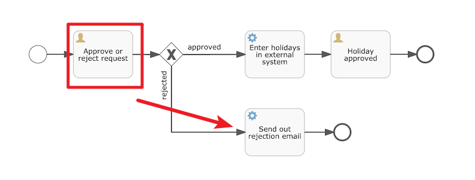

# 项目介绍

利用Flowable实现的demo


## 部署流程

执行该方法日志操作成功：


act_re_deployment: 流程定义部署表，**每部署一次就增加一条记录**


act_re_procdef ：流程定义表，**部署每个新的流程定义都会在这张表中增加一条记录**


act_ge_bytearray ：流程资源表，**流程部署的 bpmn文件和png图片会保存在该表中**


## 启动流程

启动成功，输出结果如下：


```
流程定义的ID：holidayRequest:2:2503
流程实例的ID：2501
当前活动的ID：null
```

对应的流程实例ID为：2501

启动流程实例涉及到的表结构：

* act_hi_actinst 流程实例执行历史
* act_hi_identitylink 流程的参与用户的历史信息
* act_hi_procinst 流程实例历史信息
* act_hi_taskinst 流程任务历史信息
* act_ru_execution 流程执行信息
* act_ru_identitylink 流程的参与用户信息
* act_ru_task 任务信息


其中，2501应为启动实例，二2505则为经理处理的实例


## 查看任务

&emsp;上面员工发起了一个请假流程，接下来就会流转到总经理这儿来处理，之前我们没有指定经理这的处理人，我们可以加一个


删除id为1的流程


然后重新部署


然后查看XiaoMing的任务


## 完成任务

&emsp;现在李四这个角色可以来完成当前的任务了



&emsp;在此处我们直接解决掉这个请假，然后会走发送拒绝邮件的流程，这块我们需要用到JavaDelegate来触发。


# 数据库表结构

数据库会自动创建30张表


# 参考资料

[Flowable教程视频](https://www.bilibili.com/video/BV1bq4y1v7BQ?p=36&vd_source=52cd9a9deff2e511c87ff028e3bb01d2)